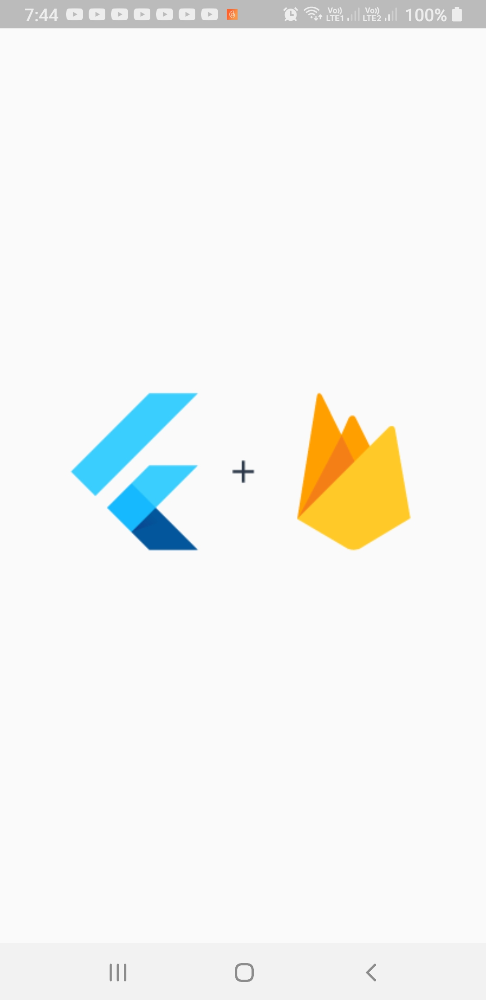
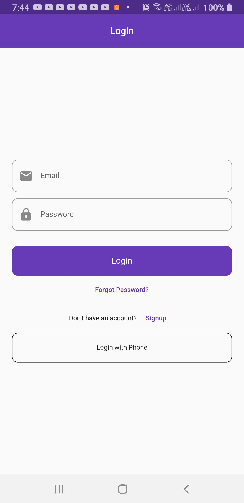

# Week 03 (Firebase)

In this week, I learnt, how to work with Firebase in Flutter. I learnt how to use Firebase Authentication, Cloud Firestore, and Firebase Storage.

## Firebase Authentication

Firebase Authentication is a service that provides backend services, easy-to-use SDKs, and ready-made UI libraries to authenticate users to your app. It supports authentication using passwords, phone numbers, popular federated identity providers like Google, Facebook and Twitter, and more.
In this example, I used email and password authentication. I designed four screens for this example:

- `SplashScreen` - This screen is shown when the app is launched. It checks if the user is logged in or not. If the user is logged in, it navigates to the PostsScreen. If the user is not logged in, it navigates to the LoginScreen.
- `LoginScreen` - This screen is shown when the user is not logged in. It has two text fields for email and password. It also has a button to login. If the user is not registered, it navigates to the SignUpScreen.
- `SignUpScreen` - This screen is shown when the user is not registered. It has two text fields for email and password. It also has a button to sign up. If the user is already registered, it navigates to the LoginScreen.
- `PostsScreen` - This screen is shown when the user is logged in. It has a button to sign out.

### Phone Number Authentication

I extended the example to use phone number authentication. I designed two screens for this example:

- `PhoneLoginScreen` - This screen is shown when the user wants clicks on `Login with phone` button added on login screen. It has a text field for phone number. It also has a button to login. After clicking on the button, it sends a verification code to the phone number, and user is redirected to the `VerifyCodeScreen`.

- `VerifyCodeScreen` - This screen is shown to the user, after the user clicks on the `Login` button on `PhoneLoginScreen`. It has a text field for inserting 6 digits verification code. It also has a button to verify the code. After clicking on the button, it verifies the code, and if the code is correct, it logs the user in.

### Reset Password

I extended the example to use reset password. I added a new screen `ForgotPasswordScreen`, where user can enter their email address, and a reset password link is sent to the email address.

## Firebase Database

Firebase Database is a cloud-hosted database. Data is stored as JSON and synchronized in realtime to every connected client. It is a NoSQL database. It is a good choice for mobile apps that require a realtime database.

### CRUD Operations

- `Create`: I added an Floating Action Buttton in `PostsScreen`, whih navigates me to a new screen `AddPostScreen`, where I can create a new post. This screen has a Text field to add post text, and a button to create the post in Realtime Database.
- `Read`: I learnt how to fetch list of posts from a collection, using FirebaseAnimatedList and StreamBuilder. I also learnt how to search for a post in the rendered list.
- `Update`: I added a popup menu button in each post, which has an option to edit the post. This option navigates pops up a dialog, where I can edit the post text. This popup has a Text field to edit post text, and a button to update the post in Realtime Database.
- `Delete`: I added a popup menu button in each post, which has an option to delete the post.

## Firebase Firestore

Firebase Firestore is a flexible, scalable database for mobile, web, and server development from Firebase and Google Cloud Platform. Like Firebase Realtime Database, it is also a cloud-hosted database. It stores data in documents, which are organized into collections. It is a NoSQL database. It is a good choice for mobile apps that require a realtime database.

### CRUD Operations

I learnt how to perform CRUD operations on Firestore. I learnt how to fetch list of posts from a collection, using StreamBuilder. I also learnt how to search for a post in the rendered list. I replaced the Realtime Database with Firestore in the previous example.

## Firebase Storage

I learnt how to upload images to Firebase Storage. I added a new screen, where user can pick an image from the local storage and upload it to the Firebase storage, and URL of the image from Firebase Storage is further stored in Realtime Database.

|     Splash Screen      |     Login Screen      |
| :--------------------: | :-------------------: |
|  |  |
